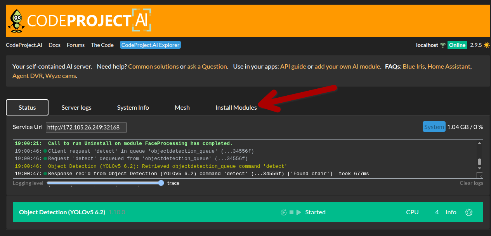
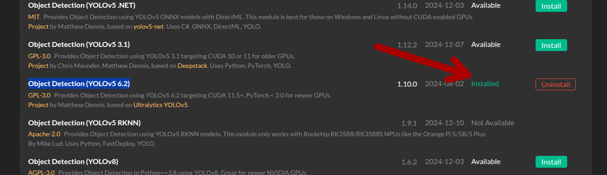

# Installation
Documentation des étapes pour l'installation, la configuration et le lancement des bases du projet.


### Prérequis 
- Serveur Ubuntu 24.04lts  
- Sécurisation du serveur : [Documentation Sécurisation](https://docs.google.com/presentation/d/1PU63Hrt2aySgctg5CeqcCKHfleh34lCsptgdP1UKmCU/edit?slide=id.g124275a85d6_0_138#slide=id.g124275a85d6_0_138)    


## Sécurisation et activation des ports requis
```bash
sudo ufw allow 22/tcp
sudo ufw allow 80/tcp
sudo ufw allow 443/tcp
sudo ufw allow 32168/tcp

sudo ufw enable
```


## Installation .NET 9 
```bash
sudo apt-get update
sudo add-apt-repository ppa:dotnet/backports
sudo apt-get install -y dotnet-sdk-9.0
```

S'il y a des erreurs, effectuer les commandes suivantes : 
```bash
sudo apt-get install -y aspnetcore-runtime-9.0
sudo apt-get install -y dotnet-runtime-9.0
```


## Installation *CodeProject.AI-Server*  
- Téléchargement du package CodeProject.AI :  
`wget https://codeproject-ai-bunny.b-cdn.net/server/installers/linux/codeproject.ai-server_2.9.5_Ubuntu_x64.zip`  

- Installation du .deb :  
```bash
sudo apt install unzip
unzip codeproject.ai-server_2.9.5_Ubuntu_x64.zip
ls
rm codeproject.ai-server_2.9.5_Ubuntu_x64.zip

sudo dpkg -i codeproject.ai-server_2.9.5_Ubuntu_x64.deb
sudo apt --fix-broken install -y

pushd "/usr/bin/codeproject.ai-server-2.9.5/" && bash setup.sh && popd
pushd "/usr/bin/codeproject.ai-server-2.9.5/server" && bash ../setup.sh && popd
```


## Lancement et test du service  
- Lancement du service :  
```bash
sudo systemctl start codeproject.ai-server
sudo systemctl enable codeproject.ai-server
```  

Teste à effectuer dans le serveur, devrait retourner du html :  
```bash
curl http://localhost:32168
```  
tester la page sur un navigateur : http://<*votre adress ip*>:32168


## Sécurisation du service avec un Reverse Proxy :  
Entrer un user et un mot de passe.
```bash
sudo apt install nginx apache2-utils
sudo htpasswd -c /etc/nginx/.htpasswd <yourusername>
```

```bash
sudo rm /etc/nginx/sites-enabled/default
sudo nano /etc/nginx/sites-available/codeproject 
```

Création d'une config, s'assurer que le contenu du fichier `codeproject` est commme suit : 
```nginx
server {
    listen 80;
    server_name <votre adress ip>;

    client_max_body_size 20M;

    # 1 - Public site (no auth)
    location / {
        root /var/www/html;
        index index.html;
    }

    # 2 - Protected app
    location /codeproject/ {
        auth_basic "Restricted Access to the Cream";
        auth_basic_user_file /etc/nginx/.htpasswd;

        proxy_pass http://<votre adress ip>:32168/;

        proxy_set_header Host $host;
        proxy_set_header X-Real-IP $remote_addr;
        proxy_set_header X-Forwarded-For $proxy_add_x_forwarded_for;
        proxy_set_header X-Forwarded-Proto $scheme;

        proxy_connect_timeout 300s;
        proxy_send_timeout 300s;
        proxy_read_timeout 300s;
    }
}
```

```bash
sudo ln -s /etc/nginx/sites-available/codeproject /etc/nginx/sites-enabled/
sudo systemctl restart nginx
```

## Création du site html pour l'analyse d'image
Verifier si le dossier www existe : 
```bash
cd /var/
ls
mkdir www
```

Créer le fichier Html suivant sur le serveur, http://<*votre adress ip*> :
```bash
cd www
touch index.html
```

Modifier les permissions : 
```bash
sudo chown -R <username>:www-data /var/www/html
```

`nano /var/www/html/index.html` :  
```html
<html>
    <body>
    Detect the scene in this file: <input id="image" type="file" />
    <input type="button" value="Detect Scene" onclick="detectScene(image)" />

    <script>
    function detectScene(fileChooser) {
        var formData = new FormData();
        formData.append('image', fileChooser.files[0]);

        fetch('http://<votre adress ip>/codeproject/v1/vision/detection', {
            method: "POST",
            body: formData
        })
        .then(response => response.json())
        .then(data => {
            console.log(data);

            const pred = data.predictions?.[0];

            if (pred) {
                console.log(pred.label, pred.confidence);
            }
        });
    }
    </script>
    </body>
</html>
```

## Configuration des modules de CodeProject.AI :
Dans le panel CodeProject.AI `http://<votre adress ip>:32168/`, désinstaller tous les modules existantes, excepté `Object Detection (YOLOv5 6.2)` :  
  
S'assurer de garder :   
  