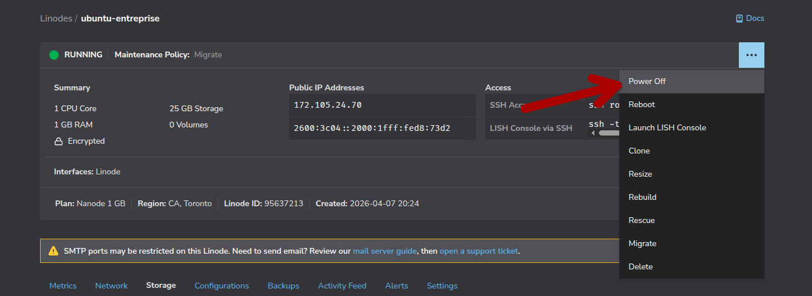
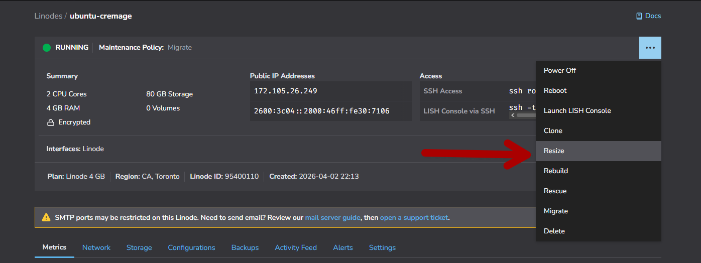
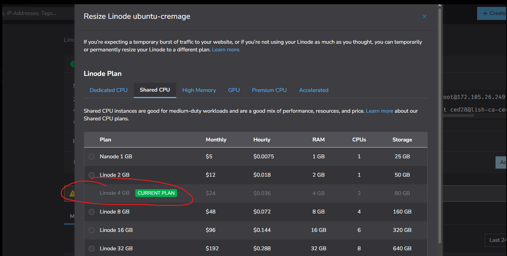
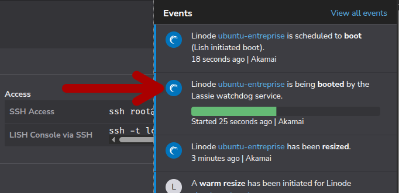
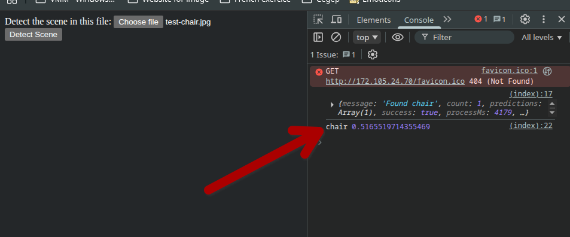
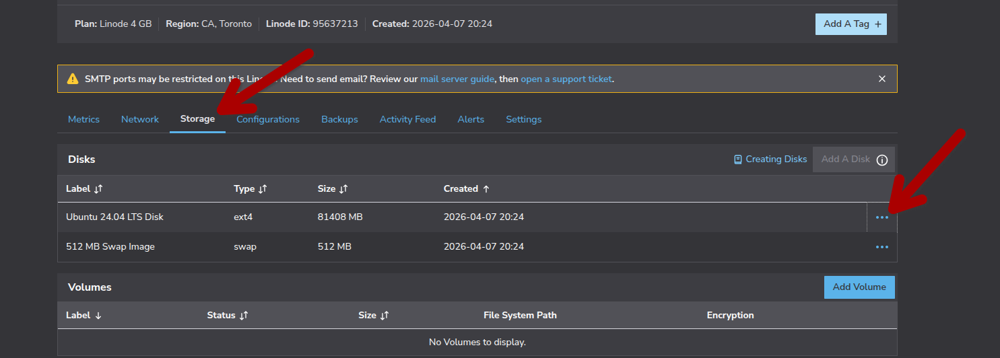
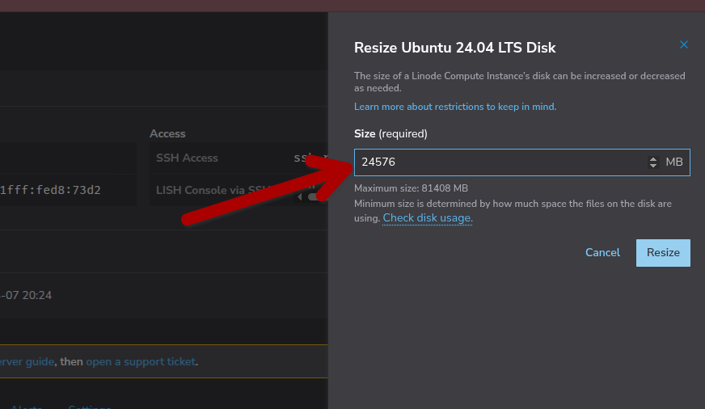

# Test
Documentation des étapes pour tester le service une fois installer et configuré. Dernière configuration avant l'analyse de l'image test  

### Configuration du VPS Linode
Maintenant, pour pouvoir upload l'image suivante à analyser par le service : 
[Image de test, une image de chaise](./images/test-chair.jpg)  

Il faut 'rezise' le linode pour le convertir en Linode 4 GB temporairement, cela va augmenter les ressources du server (CPU & RAM) temporairement, permettant ainsi l'exécution d'analyse d'image. Pour ce faire, il faut d'abord 'Power Off' le serveur :  
  

Ensuite, il faut sélectionner l'option 'rezise' et sélectionner l'option '4 GB' :
  
  

> **_NOTE:_**  Linode utilise une facturation à l'heure. Si vous augmentez la puissance de votre VPS pour une heure seulement, vous ne paierez le tarif du plan supérieur que pour cette heure précise, donc ce cas-ci, 0.036$ pour l'heure.  !! IL FAUT DONC S'ASSURER DE RESIZE LE SERVER AU PLAN 1GB À LA FIN DE L`ATELIER POUR ÉVITER DES COÛT SUPPLÉMENTAIRE. !!

Attendre que Linode resize le VPS :  

### Résultat attendue : 
Et finalement, rallumer le serveur et envoyer l'image [Image de test, une image de chaise](./images/test-chair.jpg) à partir du site 'http://\<your ip address>'.

### Configuration inverse pour retourner au plan 1 GB
Si vous ne voulez pas simplement drop toute le serveur et devoir recommencer les configuration de bases, il faut, pour rezise au plan 1 GB, 'Power Off' le serveur, aller dans l'option suivante pour 'rezise the server storage' :  
  
Entrer la valeur suivante :  
  
Puis rezise le plan du serveur.