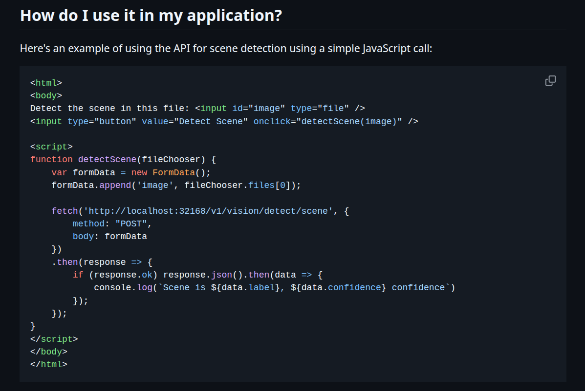
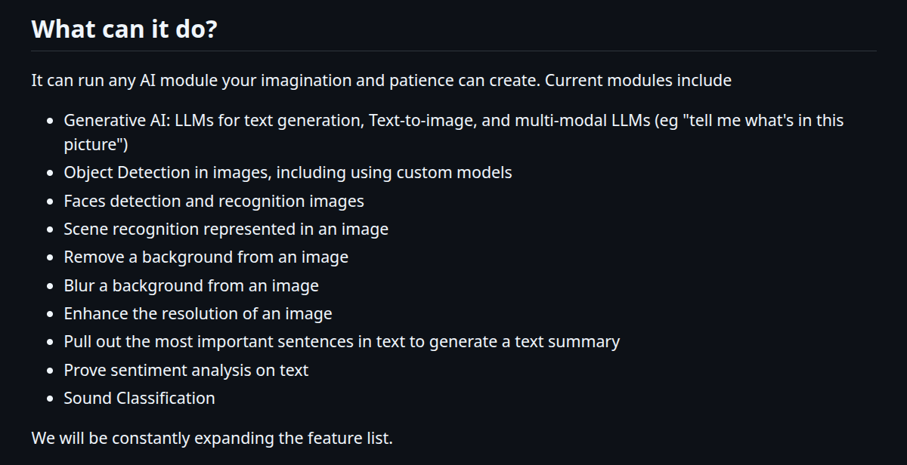

# Brainstorming

Projet de récupération d'image soit par une caméra, soit pat upload direct d'image via un site web ou directement dans le serveur. 
<br>Utilisation de **CodeProject.AI** comme technologie a implémenter dans le serveur : [Repository Github](https://github.com/codeproject/CodeProject.AI-Server/tree/main). 

## Conditions de choix de l'énoncé : 
*Le service doit être :*
1. ***Un logiciel libre et open-source à 100%*** - Open source, voir le [Repository Github](https://github.com/codeproject/CodeProject.AI-Server/tree/main)
2. ***Être hébergé à 100% sur votre VPS*** : CodeProject.AI Server est : 
    ```
    A standalone, self-hosted, fast, free and Open Source Artificial Intelligence microserver for any platform, any language. It can be installed locally, required no off-device or out of network data transfer, and is easy to use.
    ```
3. ***Répondre au paradigme client-serveur*** - Il faudrait alors que le client puisse upload les images soit par Konsole SSH avec Sftp soient par un site web. Il doit aussi voir les résultats. Cela se ferait avec des requêtes Get&Post comme indiqué dans le Repository Github : 
    <br>

4. ***Il doit avoir une exécution permanente sur le serveur*** - On doit alors choisir entre les choix suivants : 
    - *~~En train d'écouter sur un port~~*
    - *Soit un service daemon, utilisé avec la commande 'service'.* - On pourrait utilisé aussi une redirection Vhost pour le site dans le server pour remplir la condition *client-serveur*.
    - *~~Soit un logiciel qui se lance en ligne de commande qu'on va rendre permanent~~*

5. ***N'est pas un logiciel qui est seulement un site web (CMS)** - Toute la partie de CodeProject.ia pour la récupération et le traitement d'image serait alors pas *juste* un site web.

## Détail concernant le concrèt du processus : 
Alors notre but, c'est concrètement de récupérer des images pour le faire traiter par l'ia CodeProject.ia pour avoir un résultat, pour ce faire, voici les options qu'on peut utilisé, venant du Readme.md du Repository Github : 



(Emmanuel) : Je suggère d'utilisé le module inclut dans CodeProject.ia "Object Detection in image". Pour quel object ? Ça on pourrait voir plus tard. Concernant les images, je pense que le plus simple serait d'utilisé la caméra de notre ordinateur, et qu'en suite, le client voit quel object le server pense que c'est. Une suggestion, si vous penser pour d'autre chose, dit-le. Il faudrait alors espérer que comme indiqué dans le Readme.md du CodeProject.ia, que ce soit aussi simple comme ils le disent.